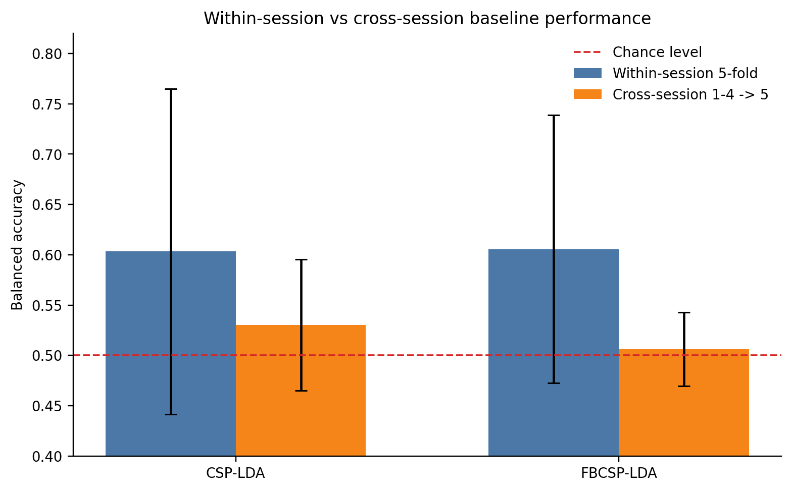
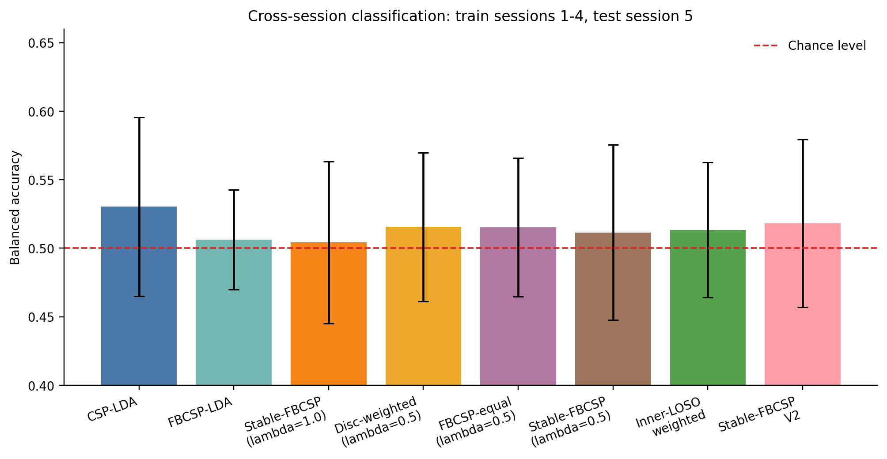
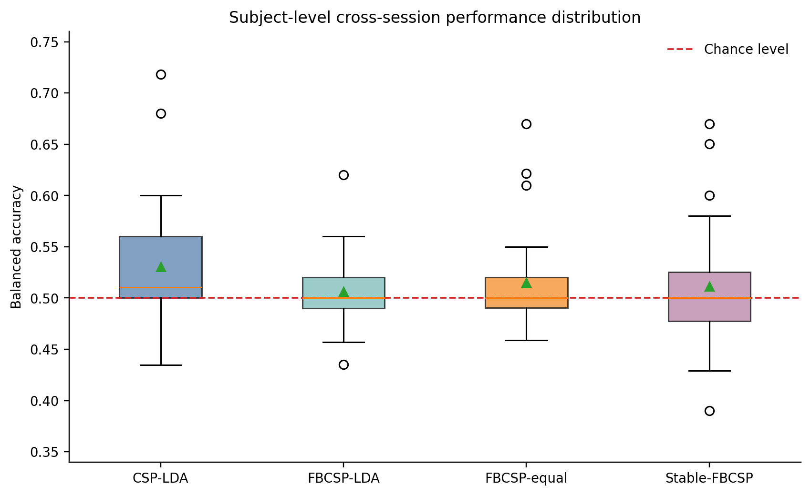
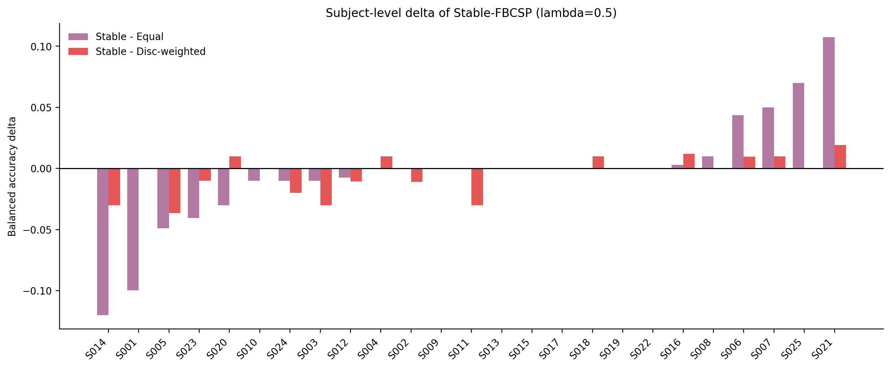
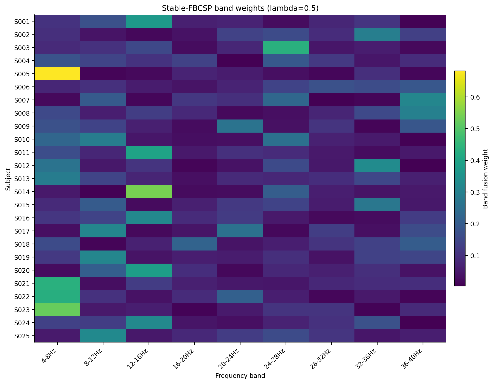
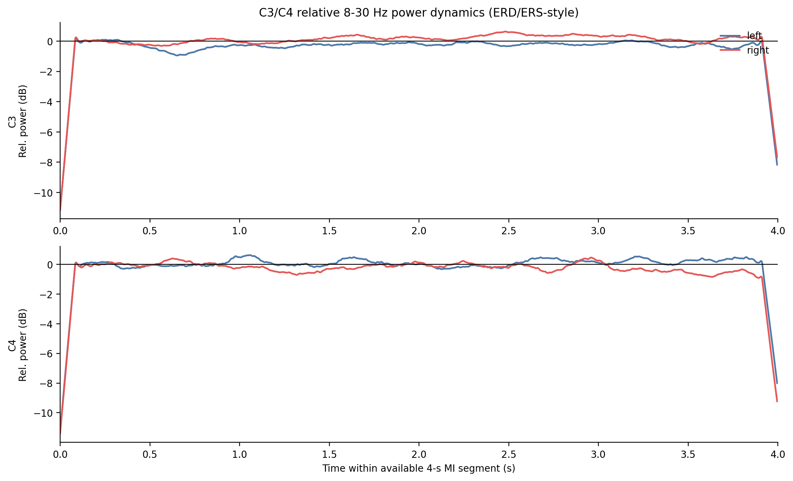
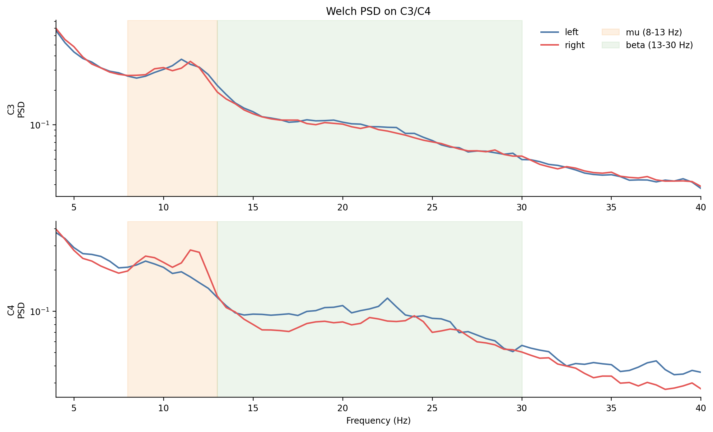
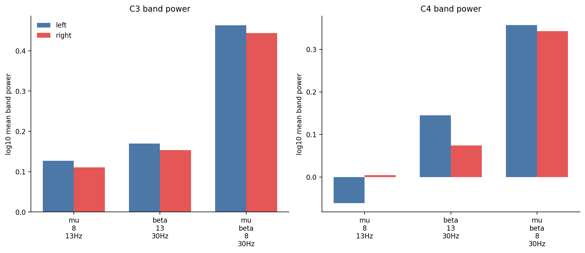
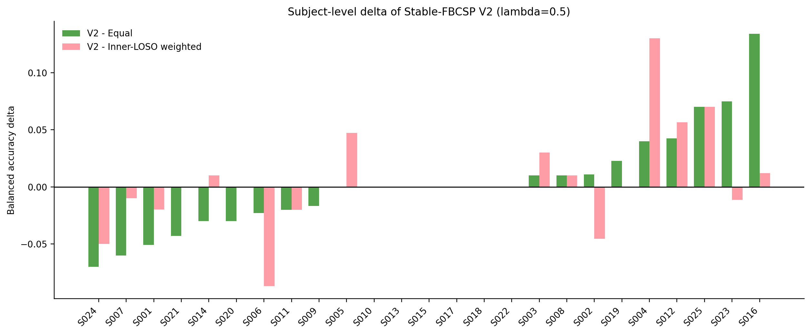
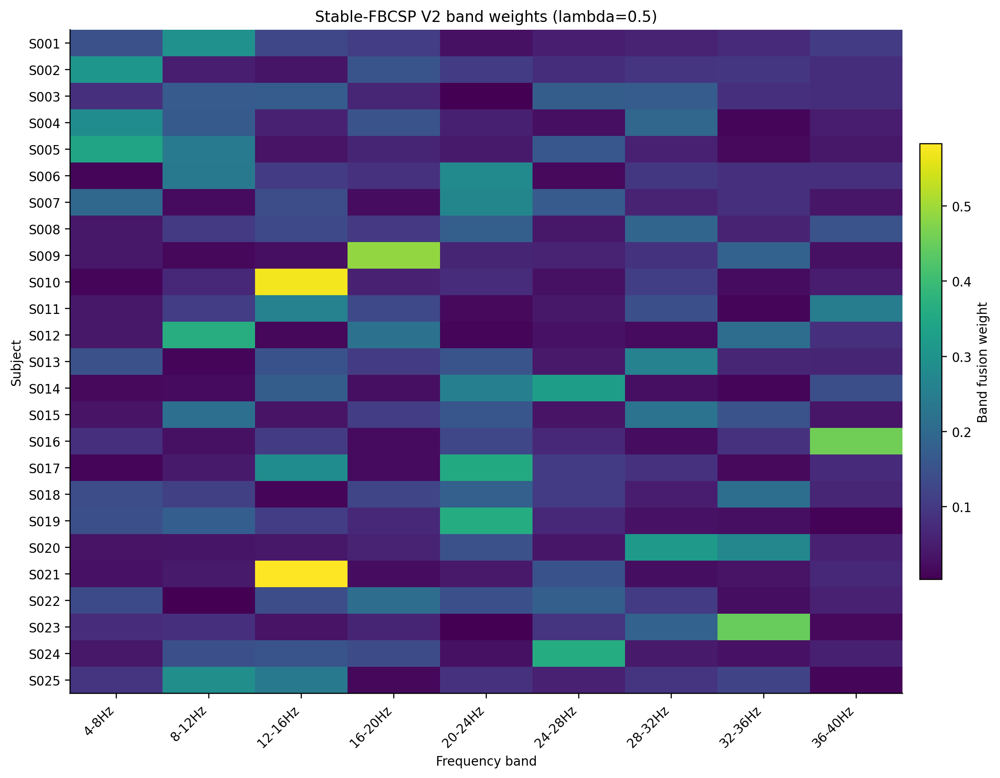

# 阶段性实验结果分析

更新时间：2026-06-22

本文档汇总当前已经完成的 CPU 实验结果，用于支撑课程设计报告“实验结果与分析”章节，也作为后续 GitHub 开源项目的结果说明基础。当前阶段的核心工作不是追求某个模型在数值上“最好看”，而是在严格无泄漏协议下建立可信基线，并围绕跨 session 泛化困难开展可解释的方法尝试。

## 1. 数据审计结果

本项目使用 SHU 运动想象 EEG 数据。当前整理后的数据目录包含三类主要文件：

- `data/raw/mat/`：正式分类实验使用的 trial-level `.mat` 文件；
- `data/raw/edf/`：同一批 session 的 EDF 格式 EEG 数据；
- `data/raw/events/`：EDF 对应的事件标注文件。

需要特别说明：`mat/`、`edf/` 和 `events/` 不是三个独立数据集，而是同一数据集的不同表示或辅助标注。本阶段分类实验主要读取 `.mat` 文件，未调用 MATLAB，也未直接使用 EDF 作为训练输入。

数据审计结果如下：

| 项目 | 数量 |
|---|---:|
| MAT 文件 | 125 |
| EDF 文件 | 125 |
| events 文件 | 125 |
| 被试数 | 25 |
| session 总数 | 125 |
| 通道数 | 32 |
| events trial 总数 | 11988 |
| 左手想象 trial | 5983 |
| 右手想象 trial | 6005 |
| 不完整 session 记录 | 0 |

审计过程中发现 `sub-001_ses-04_task_motorimagery_events.tsv` 缺少表头，但事件内容有效，审计脚本已兼容该情况。总体上，当前整理后的数据结构完整，可以支撑 25 名被试、每名 5 个 session 的完整实验。

## 2. 实验协议

当前已经完成两类协议：

1. within-session 5-fold：在每个被试、每个 session 内进行 5 折交叉验证，用于评估模型在同一 session 内对运动想象 EEG 的可分性；
2. cross-session train 1-4 test 5：使用每名被试的 session 1-4 训练，在 session 5 上测试，用于评估跨 session 泛化能力。

所有正式结果均遵守无泄漏规则：

- 测试 session 只用于最终评估；
- CSP 空间滤波器、StandardScaler、LDA 分类器均只在训练数据上拟合；
- Stable-FBCSP 的频带权重只根据训练 session 计算；
- 没有将同一 session 的 trial 随机打散后同时放入训练集和测试集来冒充跨 session 实验。

当前所有实验均在本机 CPU 上通过 Python 脚本完成，使用的 Conda 环境为 `mi-eeg-cpu`，Python 路径为 `D:\miniconda3\envs\mi-eeg-cpu\python.exe`。

## 3. CSP/FBCSP 基线结果

当前完成了 CSP-LDA 与 FBCSP-LDA 两个传统基线。汇总结果如下，指标均为 mean ± std。

| 协议 | 方法 | n | Accuracy | Balanced Accuracy | Macro-F1 | Kappa |
|---|---|---:|---:|---:|---:|---:|
| within-session 5-fold | CSP-LDA | 125 | 0.6037 ± 0.1616 | 0.6034 ± 0.1617 | 0.6024 ± 0.1622 | 0.2068 ± 0.3234 |
| within-session 5-fold | FBCSP-LDA | 125 | 0.6059 ± 0.1329 | 0.6056 ± 0.1331 | 0.6047 ± 0.1334 | 0.2112 ± 0.2661 |
| cross-session 1-4→5 | CSP-LDA | 25 | 0.5315 ± 0.0646 | 0.5303 ± 0.0652 | 0.4750 ± 0.0965 | 0.0605 ± 0.1306 |
| cross-session 1-4→5 | FBCSP-LDA | 25 | 0.5075 ± 0.0358 | 0.5061 ± 0.0364 | 0.4141 ± 0.0716 | 0.0120 ± 0.0735 |

对应图表：

从结果可以看到，within-session 协议下 CSP-LDA 和 FBCSP-LDA 的 balanced accuracy 均约为 0.60，说明传统空间滤波方法能够从该数据集中提取到一定的运动想象判别信息。但在 cross-session 协议下，性能明显下降到接近随机水平，其中 CSP-LDA 为 0.5303，FBCSP-LDA 为 0.5061。这表明本项目真正困难的问题不是“同一 session 内能否分类”，而是“训练 session 到测试 session 之间的分布漂移如何处理”。

这个现象也说明，课程设计报告中不应只展示 within-session 结果。如果只做 session 内随机交叉验证，可能会高估模型在真实跨天/跨 session 应用中的泛化能力。

## 4. Stable-FBCSP 方法尝试与修正

基于跨 session 性能下降的问题，本项目尝试了 Stable-FBCSP：跨 session 稳定性加权的 Filter Bank Common Spatial Pattern。初始想法是：传统 FBCSP 更关注频带在训练数据中的判别能力，但 SHU 数据具有多个 session，因此频带选择不应只看“强不强”，还应考虑“稳不稳”。

当前实现比较了三种频带融合策略：

- FBCSP-equal：各频带等权概率融合；
- FBCSP-discriminative-weighted：根据训练 session 内部判别分数进行频带加权；
- Stable-FBCSP：根据 `z(mean_score) - λ * z(session_std)` 进行频带加权。

实验过程中发现了一个重要方法问题：如果先对 FBCSP 特征乘以频带权重，再使用 `StandardScaler + LDA`，这种尺度权重会被标准化和线性分类器的尺度不变性基本抵消。因此，Stable-FBCSP 被修正为“频带级概率融合”：

1. 每个频带单独训练 CSP-LDA；
2. 每个频带输出类别概率；
3. 使用频带权重对概率进行加权融合；
4. 最终根据融合概率进行分类。

这是一条很重要的实验反思：方法设计不能只写公式，还要检查公式在具体机器学习流水线中是否真正影响了决策边界。

## 5. Cross-session 方法对比

当前 cross-session 方法对比如下：

| 方法 | λ | Balanced Accuracy |
|---|---:|---:|
| CSP-LDA | - | 0.5303 ± 0.0652 |
| FBCSP-LDA | - | 0.5061 ± 0.0364 |
| FBCSP-equal probability fusion | 0.5 | 0.5152 ± 0.0504 |
| FBCSP-discriminative-weighted | 0.5 | 0.5154 ± 0.0543 |
| Stable-FBCSP | 1.0 | 0.5042 ± 0.0590 |
| Stable-FBCSP | 0.5 | 0.5115 ± 0.0638 |

对应图表：

从整体均值看，CSP-LDA 仍是当前最强的 cross-session 传统基线。原始特征拼接式 FBCSP-LDA 的 cross-session balanced accuracy 为 0.5061，而频带概率融合版 FBCSP 的结果提升到约 0.515，说明“按频带建模再融合”相对原始拼接式 FBCSP 有一定改善。

但是，当前版本 Stable-FBCSP 并没有超过等权融合或仅判别性加权。λ=1.0 时 balanced accuracy 为 0.5042，λ=0.5 时提升到 0.5115，但仍低于 FBCSP-equal 和 FBCSP-discriminative-weighted。

这说明当前“训练 session 内半分验证得到的 session_std”可能并不能可靠估计真正的跨 session 稳定性。换句话说，当前 Stable-FBCSP 的假设有合理动机，但稳定性估计方式还不够严格。

## 6. 被试层面的差异分析

跨 session 分类存在明显被试差异。下图展示了不同方法在 25 名被试上的 balanced accuracy 分布：

进一步比较 λ=0.5 时 Stable-FBCSP 与两个概率融合基线的被试级差异：

统计结果显示，λ=0.5 时：

- Stable-FBCSP 相比 FBCSP-equal 的平均差值约为 -0.0037；
- 25 名被试中，Stable-FBCSP 相比 FBCSP-equal 有 6 名提升、10 名持平、10 名下降；
- Stable-FBCSP 相比 FBCSP-discriminative-weighted 的平均差值约为 -0.0039；
- 25 名被试中，Stable-FBCSP 相比 FBCSP-discriminative-weighted 有 7 名提升、10 名持平、9 名下降。

这说明当前稳定性加权策略不是完全无效：它在部分被试上确实可能带来提升。但由于提升不稳定，整体均值没有超过更简单的频带融合方法。因此，后续不应直接声称 Stable-FBCSP 已经取得稳定改进，而应把它作为一次方法探索，并进一步改进频带稳定性估计方式。

## 7. 频带权重分析

Stable-FBCSP 的频带权重如下图所示：

该热力图可用于报告中说明：不同被试的有效频带并不完全一致，运动想象 EEG 的频带贡献具有个体差异。这也解释了为什么简单固定频带或简单拼接全部频带在跨 session 设置下可能不够稳健。

不过，当前权重热力图只能说明“权重分配存在差异”，还不能证明“权重分配带来了性能提升”。要进一步支持 Stable-FBCSP，需要在后续版本中使用更接近目标任务的训练内验证协议来估计频带泛化能力。

## 8. 当前阶段结论

当前阶段可以形成以下结论：

1. 数据整理完整，MAT/EDF/events 数量一致，25 名被试、125 个 session 可用于实验；
2. CSP-LDA 与 FBCSP-LDA 在 within-session 协议下达到约 0.60 balanced accuracy，说明数据中存在可学习的运动想象判别信息；
3. 在 cross-session 训练 1-4、测试 5 的协议下，性能明显接近随机水平，session drift 是本项目的核心难点；
4. 原始拼接式 FBCSP-LDA 在 cross-session 下不如 CSP-LDA，说明频带扩展并不必然提高跨 session 泛化；
5. 频带级概率融合 FBCSP 相比原始拼接式 FBCSP 有一定改善；
6. 当前 Stable-FBCSP 没有超过等权/判别性加权概率融合，但这一负结果揭示了稳定性估计方式需要改进；
7. 后续最值得做的 CPU 扩展是 Stable-FBCSP V2：在训练 session 1-4 内部采用 leave-one-session-out 估计每个频带的跨 session 泛化能力，再用于 session 5 测试。

## 9. 对课程设计报告的建议写法

报告中建议采用如下叙述逻辑：

> 本文首先完成 SHU 运动想象 EEG 数据审计，并明确 MAT、EDF 与 events 文件的关系。随后在严格无泄漏协议下复现 CSP-LDA 与 FBCSP-LDA 传统基线，发现 session 内分类结果约为 60%，但跨 session 分类明显下降到接近随机水平。针对该问题，本文尝试基于频带判别性与稳定性构造 Stable-FBCSP。实验过程中发现简单特征尺度加权会被标准化与线性分类器抵消，因此将方法修正为频带级概率融合。最终结果显示，概率融合 FBCSP 相比原始 FBCSP 有一定改善，但当前 Stable-FBCSP 稳定性惩罚未带来总体提升，提示跨 session 稳定性需要通过更严格的训练内 leave-one-session-out 方式估计。

这个写法的优点是诚实、完整、有科研训练痕迹：既有可信基线，也有方法假设、实现修正、实验验证和负结果反思。

## 10. 信号分析可视化结果

为了补足课程设计中“预处理及信号分析”部分，本项目新增了 C3/C4 通道上的 ERD/ERS-style 相对功率动态、Welch PSD 频谱曲线和频带功率统计。可视化脚本为 `experiments/08_signal_visualization.py`。

需要注意：当前 `.mat` 文件包含的是 4 秒运动想象片段，而不是完整 0-8 秒 cue-locked trial。因此本项目使用可用 4 秒片段的前 0.5 秒作为内部 baseline，绘制 8-30 Hz 相对功率动态。报告中建议称为“ERD/ERS-style 相对功率动态”或“运动想象阶段相对频带功率变化”，不要过度声称其覆盖了完整静息-提示-运动想象全过程。

正式报告建议优先使用 C3/C4 target-clean 版本图。该版本只在可视化阶段剔除 C3/C4 上最大绝对振幅超过 100 μV 的 trial，不影响前文分类实验协议。全量统计如下：

| 项目 | 数值 |
|---|---:|
| 原始 trial 数 | 11988 |
| 可视化使用 trial 数 | 11527 |
| C3/C4 阈值剔除 trial 数 | 461 |
| left trial | 5758 |
| right trial | 5769 |
| 通道 | C3, C4 |
| 可视化阈值 | abs amplitude ≤ 100 μV |

ERD/ERS-style 相对 8-30 Hz 功率动态图如下：

Welch PSD 频谱图如下：

C3/C4 频带功率统计图如下：

频带功率表明，C3/C4 在 μ 节律、β 节律以及 8-30 Hz 范围内存在可观察的功率差异，但这种差异并不是简单、稳定、强幅度的单一模式。这与分类实验中“session 内可分、跨 session 困难”的现象是一致的：运动想象 EEG 中确实存在可学习的频域/空间信息，但其跨被试、跨 session 稳定性有限。

因此，本项目的预处理与信号分析部分可以这样表述：

- 数据发布者已完成基础清洗和滤波；
- 本项目在二次分析阶段进行去均值、频带滤波、CSP/FBCSP 特征构造；
- 对 C3/C4 进行 ERD/ERS-style 和 PSD 可视化，用于验证运动想象相关节律信息；
- 分类实验与可视化清洗严格分离，可视化阈值不参与模型训练和测试。

## 11. Stable-FBCSP V2：训练内 leave-one-session-out 频带稳定性

在 V1 结果之后，本项目进一步实现了 Stable-FBCSP V2。V2 的核心变化是：不再使用单个训练 session 内部半分验证的波动来估计频带稳定性，而是在训练 session 1-4 内部做 leave-one-session-out 验证。具体而言，每次使用 3 个训练 session 训练某一频带的 CSP-LDA，并在剩余 1 个训练 session 上验证，由此得到每个频带在训练数据内部的跨 session 泛化分数。

该设计比 V1 更贴近最终任务，因为最终测试同样是跨 session：训练 session 1-4，测试 session 5。同时，session 5 仍然完全不参与频带评分、权重计算、CSP 拟合、标准化或分类器训练。

V2 的 cross-session 汇总结果如下：

| 方法 | Balanced Accuracy |
|---|---:|
| FBCSP-equal | 0.5152 ± 0.0504 |
| FBCSP-innerLOSO-weighted | 0.5132 ± 0.0493 |
| Stable-FBCSP-V2 | 0.5181 ± 0.0613 |

对应被试级差异图如下：

V2 结果说明：

- Stable-FBCSP-V2 相比 V1 的 Stable-FBCSP λ=0.5 从 0.5115 提升到 0.5181；
- Stable-FBCSP-V2 相比 FBCSP-equal 平均提升约 +0.0028；
- 25 名被试中，V2 相比 FBCSP-equal 有 9 名提升、6 名持平、10 名下降；
- V2 相比 FBCSP-innerLOSO-weighted 平均提升约 +0.0049；
- bootstrap 95% CI 跨过 0，因此该结果应表述为轻微改善趋势，而不是显著提升。

V2 的频带权重热力图如下：

从课程设计和科研训练角度看，V2 是比 V1 更值得保留的自创方法版本。它没有超过 CSP-LDA，但相比原始 FBCSP-LDA、V1 Stable-FBCSP 和简单概率融合方法表现更合理。报告中建议将其定位为：一种基于训练内跨 session 验证的频带稳定性加权尝试，实验显示存在轻微改善趋势，但受限于被试差异和样本规模，仍需进一步结合 EA、Riemannian 方法或深度域适应来提升跨 session 泛化。

## 12. 后续工作

若以优秀课程设计为目标，当前还需要完成：

- 报告方法章节与实验章节整理；
- 将本阶段图表放入报告；
- 准备答辩 PPT。

若以开源科研训练项目为目标，建议下一步优先完成：

1. EA + CSP/FBCSP：尝试 Euclidean Alignment 缓解 session drift；
2. GPU 扩展：EEGNet 或 FBCNet；
3. 开源整理：README、LICENSE、CITATION、`.gitignore`、复现实验说明；
4. 将可复用代码从 `experiments/` 逐步整理到 `src/mi_eeg/`。

当前不建议立刻跳到大量深度学习模型。更合理的路线是：先把传统方法、评估协议和跨 session 问题讲清楚，再用深度学习作为扩展对照。这样项目会更像一个完整科研训练项目，而不是单纯“跑了几个模型”。

